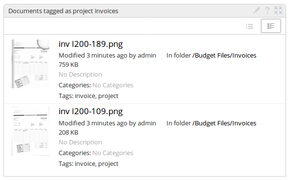
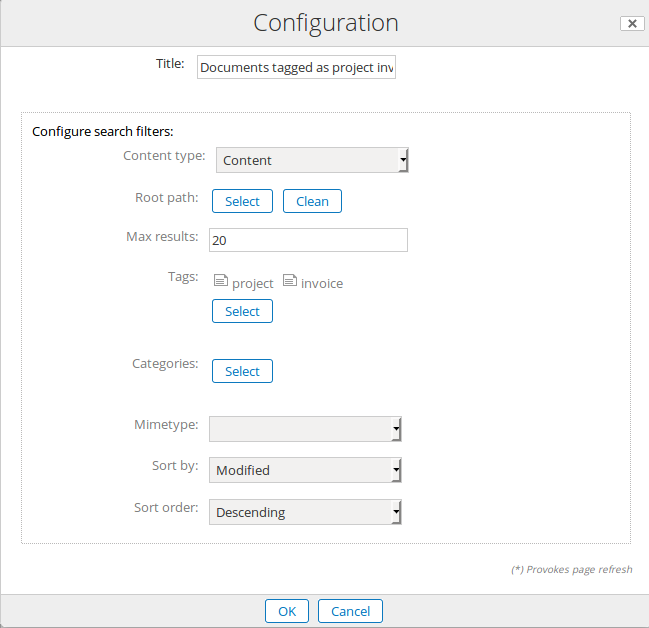

# Custom Search Dashlet

## Description
This dashlet allows to configure complex Alfresco querys and filters in user and site panels. The dashlet has several operational modes:
 - Mode 0: Just configuring filters such as path, categories, tags and mimetype. 
 - Mode 1: Selecting a saved query from Data Dictionary
 - Mode 2: Typing a Lucene query

### Mode 0: Just filter content by:
 - Document Type
 - Path
 - Multiple categories
 - Multiple tags
 - Mimetype

You may also limit the number of results, and order them by typical metadata (i.e: cm:modified and ascending or descending).

#### Using

You can use the dashlet in the user / site panels defining a custom search with the different filters. For example, some invoice scanned files are tagged with project and invoice in document library and you want to configure a dashlet for filtering project invoices in Site Demo. The result of the dashlet (in the detailed view) will be something like:

And the corresponding configuration options for the dashlet:

### Mode 1: Saved searches (disabled)

The custom search dashlet allows to have preconfigured searches in /Data Dictionary/Dynamic Queries folder. First, you need to create this folder where you can create subfolder-based structures, for defining sets of queries for different final users, using ACL permissions.
 - Group query 1 (folder)
   - Query 1 (folder):
 - Group query 2 (folder)
   - Query 2 (folder)

For Query 1:
 - Set folder name "Public and Shared"
 - Set folder description +ASPECT:\"qshare:shared\"

When available, the dashlet configuration shows a combo with the configured custom queries.

### Mode 2: Direct Lucene syntax (disabled)

In this mode, you need to type your custom query in Lucene syntax, for example: **+ASPECT:\"qshare:shared\"**

HINT: An screenshot for Mode 1 and 2 is shown in:

http://www.zylk.net/es/web-2-0/blog/-/blogs/user-dashlets-for-quick-search-and-business-views-in-alfresco-share

## Packaging

You may pack it with jar command. Go into the directory that you unzipped, or cloned via git:

    $ git clone https://github.com/zylklab/zk-custom-search-dashlet
    $ cd zk-custom-search-dashlet
    $ jar -cf zk-custom-search-dashlet.jar *

There is available an ant file (build.xml) for packaging. In this case, just type:

    $ git clone https://github.com/zylklab/zk-custom-search-dashlet
    $ ant

You should see the generated jar inside target directory. 

## Installation

Install it, copying the corresponding jar into $TOMCAT/shared/lib and restart Alfresco service

## Extra configuration of the dashlet

You may add your custom content types in (to be shown in the Document Types combo in dashlet configuration):

	alfresco/web-extension/site-webscripts/org/alfresco/modules/config-dynamic-searches.get.config.xml

## Things TODO

- [ ] Enable Mode 1 (Saved searches)
- [ ] Enable Mode 2 (Direct Lucene Syntax)
- [ ] In mode 1: Use smart query syntax for saved saved searches
- [ ] In mode 1: Create Data Dictionary structure for dynamic queries (ACP bootstrap
- [ ] Test, test, test
- [x] FIXED: Disabled modes 1 and 2
- [x] FIXED: Alphabetically mimetype values ordering
- [ ] Use Alfresco Maven SDK 
- [ ] Separate in two AMPs

## External Links
 - http://www.zylk.net/es/web-2-0/blog/-/blogs/user-dashlets-for-quick-search-and-business-views-in-alfresco-share

## Tested

The dashlet should work in Alfresco 4.2 and above. It was used (tested) in:
 * Alfresco CE 4.2.c
 * Alfresco 201602GA
 * Alfresco 201701GA 
 * Alfresco EE 4.1.5
 * Alfresco EE 4.2.4
 * Alfresco EE 5.0.3
 * Alfresco EE 5.1.2

## Authors

- Patricia Yague
- Irune Prado
- Cesar Capillas
